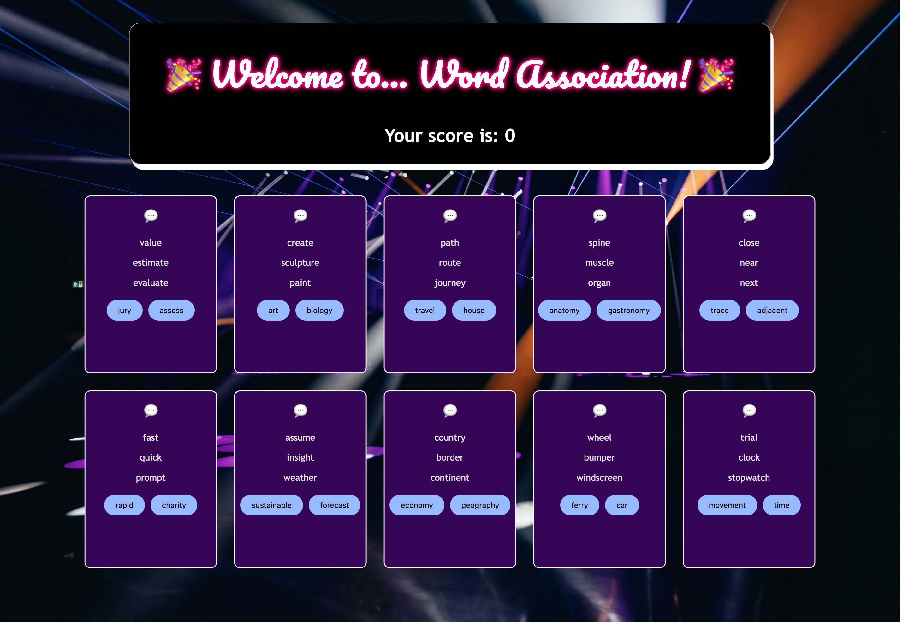

# js-word-game

## Table of contents

- [Overview](#overview)
  - [The project](#the-project)
  - [Screenshot](#screenshot)
  - [Links](#links)
- [My process](#my-process)
  - [Built with](#built-with)
  - [What I learned](#what-i-learned)
  - [Continued development](#continued-development)
  - [Useful resources](#useful-resources)
- [Acknowledgments](#acknowledgments)

## Overview

### The project

I completed the first game in this course from FreeCodeCamp, led by Ania Kubów. It is a single-player word association game.

The CSS / styling is my own design.

- I added an extra feature so that both of the buttons would be hidden after the user had clicked on their first choice. Before this, the user was still able to click on the other button they had not clicked i.e. they could score a point back, or unintentionally lose a point. For this reason, I wanted to make sure neither of these outcomes occurred whilst playing the game.

### Screenshot

### Links

- Source: https://www.freecodecamp.org/news/javascript-tutorial-code-two-word-games/

## My process

### Built with

- Semantic HTML5 markup
- CSS
- Vanilla JavaScript

### What I learned

I furthered my knowledge of arrays and loops, and it was a great opportunity to practise using callback functions.

### Continued development

I wish to further develop my skills of arrays, loops and callback functions. I'm aiming to extend this project further through the use of an API to retrieve the information for the questions and tips rather than coding them myself.

### Useful resources

- I used the Emojy extension on VS Code to insert emojis into my game.

## Acknowledgments

Thank you to https://www.freecodecamp.org and Beau Carnes https://www.freecodecamp.org/news/author/beau/ for writing the project article, and finally Ania Kubow for this informative course.
